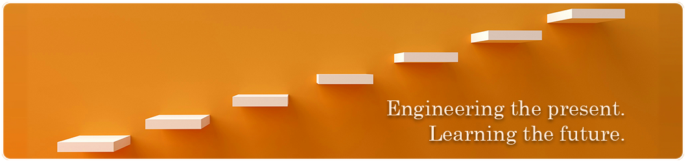

  

## Focus

`Full-Stack Web Platforms` · `TypeScript` · `React` · `Next.js` · `Node.js` · `SQL` · `AI Engineering` · `LLM Workflows` · `RAG`

## Coding Activity

### Last Year

  <figure><embed src="https://wakatime.com/share/@gabrielizalo/ebe5fe12-c2fc-4bbe-88f6-4cdb5e9f48cf.svg"></embed></figure>

### Last 30 Days

  <figure><embed src="https://wakatime.com/share/@gabrielizalo/f7ebbb2f-4ae8-4ad1-9728-37aa20373780.svg"></embed></figure>

<!--
**gabrielizalo/gabrielizalo** is a ✨ _special_ ✨ repository because its `README.md` (this file) appears on your GitHub profile.

Here are some ideas to get you started:

- 🔭 I’m currently working on ...
- 🌱 I’m currently learning ...
- 👯 I’m looking to collaborate on ...
- 🤔 I’m looking for help with ...
- 💬 Ask me about ...
- 📫 How to reach me: ...
- 😄 Pronouns: ...
- ⚡ Fun fact: ...
-->
